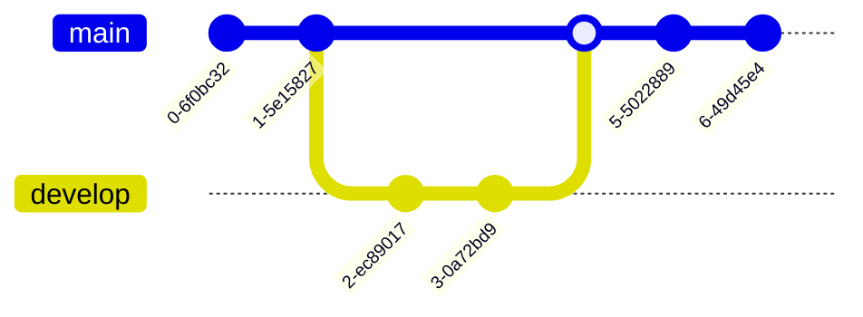

# Basic Explaination
Git is version control software which lets you easily save and undo specific changes to your work. All successful software projects use version control of some kind.

Github or Codeberg are git hosting services that can store your source code. Multiple people can contribute to the same project. You can also use Github actions to run scripts when code is submitted (pushed, see below).



You can think of git history like a chain, with each node on the chain being its own commit (with an individual commit hash for the purposes of identification).

You can branch off each node into a new branch with the original node as the base for a new branch.

You can make a pull request to merge your code changes into the chain which adds a new node with a new commit hash. Pull requests let you add code to a repository you don't have write access to.

# Useful Commands

## Gitignore

A gitignore lists files that git should, well, ignore. When adding and pushing these files will not be included. 

```
touch .gitignore
```

## Making a Commit and Pushing
A commit contains a 'diff' of your changes, i.e the difference between the most recent commit and your change.

First you need to stage your changes. You can see them with the status command.

```
git status
```

To stage everything:

```
git add .
```
To be more specific

```
git add <filename>
```

Then we want to make a commit and give it a small description:
```
git commit -m "some amazing text here"
```

Then we want to push to the upstream branch if we're happy:
```
git push
```
or
```
git push <remote> <branch>
```

After this, we might want to make a pull request and ask people to check our code in a review before we merge this to master/main.

When it comes to a commit itself, try to group relevant code together into one commit rather than squishing all your changes into one giant commit. That way, its easier to understand your history and revert more specific changes should there be any problems.

You can be really specific about what you're staging with:

```
git add -p <file>
```
This will show you the code and ask if you want to stage the hunk or not.

Finally, commit messages should clearly state what has been changed. Ideally should consist of a subject and body. Body has room for a much more detailed explaination where you can include answers for questions such as: 
1. What is the reason for the change?
2. What's different than before?
3. Any potential gotchas/notes?


## Undoing Mistakes
Primarily, this is done with the reset command. The reset command moves HEAD which you can think of as the most recent node in the chain. 

To see the log and thus the commit hashes:
```
git log
```

Undo and discard all changes:

```
git reset --hard <commit hash>
```

Undo without discarding:
```
git reset <commit hash> 
```

## Branches

### Types of Branch

1. Long running - these are branches that stick around for the whole project lifecycle. Every project has a main/master. Integration branches, usually called develop/staging are also long life. Commits tend to not be directly added, they come through a merge or a rebase. This keeps your code quality and safe! You also may want to release code in batches or stages so controlling the flow of this branch requires pull requests.
2. Short lived - usually based from a long running branch that exists for a specific feature that will be deleted after the feature itself is merged into main.

### Branching strategy

1. Github flow - there is one long running branch and multiple feature branches.
2. Gitflow - more structure, there are two long running branches, main and develop. there are mutiple short lived branches for features, releases and hotfixes. Release branches get merged back into main after testing, then you tag main with the relesase and close the release branch.

If you're working in a team, ask if there's a pre-existing branching stratety.

To make a new branch:

```
git checkout -b <branch name>
```

To switch to the branch you just made:

```
git checkout <branch name>
```
or
```
git switch <branch name>
```

Sometimes when you make a branch, you'll want to specify which upstream it should point to so that your changes go there. To do this:

```
git checkout -b <branch name> origin/example_upstream
```

## Patching
Sometimes you want to make a patch file containing all your changes for a given branch to be applied somewhere else. To do this as a single file:
```
git format-patch project/branch --stdout > example.patch
```
Then apply the patch:
```
git am example.patch
```

## Remote Branches
To grab all new changes from the upstream:
```
git fetch
```

## Github Actions
Github actions is an excellent feature you can take advantage of for free. It's especially good for ensuring committed code is quality, as you can automatically run a variety of tests.

## Forking

A fork is a copy of someone else's repository that belongs to you that you can freely modify and make your own without being related to their original project. There is a dropdown menu.

https://docs.github.com/en/pull-requests/collaborating-with-pull-requests/working-with-forks/fork-a-repo

You can use a fork to make your own changes to the original repository and then make a pull request to submit those changes to the original repository.

## Merging and Rebasing

### Merge Conflicts
Git usually can apply diffs without much trouble. However, sometimes there are contradictory changes that git cannot resolve on its own, so you'll have to do it yourself.

Visual Studio Code has a good graphical tool for solving a merge conflict graphically. You can pick and choose between both files as to which changes you want to keep or throw.

To undo a merge or rebase that's caused a conflict you can do:

```
git merge --abort
```
or 
```
git rebase --abort
```

To fix using just git tools you can use:
```
git mergetool
```

Mergetool Tutorial: https://gist.github.com/karenyyng/f19ff75c60f18b4b8149

### Rebase VS Merge

Rebase keeps the project history flat and rewrites commit history. Merge preserves the original history and parent commits. With rebase, if the commit hasn't been published yet then its okay to rewrite this history but if it's already been pushed it could cause issues if someone has branched off from a commit that rebase has rewritten.

```
git rebase <branch>
```
### Interactive Rebase

Same as above, don't do this if you've published the commits.

```
git rebase -i
```
#### Change a commits message:

```
git rebase -i <commit hash>
```
or
```
git rebase -i HEAD~<num of commits counting back from head>
```
In the next screen, change 'pick' to 'reword' on the commit you want to rename. Then save and quit and the next screen should let you change the commit message. Save and quit again.

As a side note, if the commit has not already been pushed you can do:
```
git commit --amend
```

#### Squash a series of commits into one

1. Go into rebase and keep your oldest commit as 'pick'.
2. Change the rest to 'squash'.
3. Save and close.
4. Write your message in the new window. Save and quit.

## Using Submodules
A submodule is a git repository of third party code within your git repository.

It is good practice to put submodules in a lib folder.

```
git submodule add <submodule url>
```
Parent git repository doesn't store the files.

## Reflog

We can use reflog to recover deleted commits.
```
git reflog
```
Git chronologically logs all important actions here.

Copy the commit hash of the commit before you deleted the items you wanted to recover

You can then do:
```
git reset <commit-hash>
```
or if you want to start a new branch:
```
git branch <name> <commit-hash>
```
You can also restore a deleted branch using the above.


## Cherrypicking

Sometimes we want to apply one specific commit, to another branch:

```
git cherry-pick <commit-hash> 
```
then 

```
git cherry-pick f
```

## Search and Find

Finding commits after a given date:

```
git log --after="<2000-1-2>"
```
You can also use before to find all commits before a given date:
```
git log --before<"2001-2-3">
```
Find commits from a specific person:
```
git log --author=="jane doe"
```

You can combine these into one statement.

You can search for specific files:

```
git log -- <filename>
```
You will see a list of commits where this file was changed


## Further Reading
https://www.git-tower.com/learn/git/advanced-git-kit/


## Credits
Diagram Credit: https://www.mermaidchart.com/
